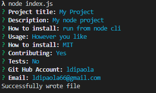

# README-Generator

# Title
  readme Generator

  ## Description
  quickly creates a README for a new project

  ## Table of Contents  
  [Installation](#Installation)    
  [License](#License)  
  [Contributing](#Contributing)  
  [Demo](#Demo)  
  [Questions](#Questions)  
   

  ## Installation

  * Run npm i run node cli
  * Run index.js from node cli

  ## License
  MIT

  ## Contributing
  No

  ## Demo

  

  ## Questions
  ldipaola
  ldipaola66@gmail.com